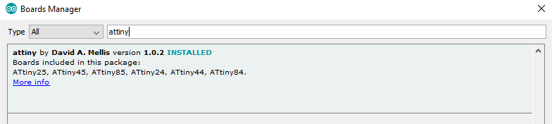

## ATtiny Programmer Shield

The best thing about at the ATtiny85 IC is undoubtedly its size, but this also makes it difficult to program. No matter how gently you pull it out of its socket, it still seems like the legs get bent (pro-tip: keep the IC in a [socket](https://jaycar.com.au/p/PI6500)
if you are continually moving it to and from a programmer, then the socket takes the wear and tear).

To make our job even easier, we put together an ATtiny Programmer Shield, using a ZIF socket to ensure that the pins are not subject to excessive forces, and wired directly to the SPI pins on the Arduino so that any Arduino main board can be used. There's no reason a similar idea can't be applied to even an ATMega328 IC (using a [28 pin ZIF socket](https://jaycar.com.au/p/PI6483)
instead). We've added some testing LEDs to the pins that aren't used for programming, so you can quickly test that the chip is working too.


## Shopping List

|Qty| Code | Description |
|---|---|---|
|1 | [XC4482](http://jaycar.com.au/p/XC4482) | Prototyping shield
|1 | [PI6480](http://jaycar.com.au/p/PI6480) | 18 pin Zif socket
|1 | [RR0564](http://jaycar.com.au/p/RR0564) | 8 pack 470 resistors
|2 | [ZD0150](http://jaycar.com.au/p/ZD0150) | Red 5mm LED
|1 | [RE6070](http://jaycar.com.au/p/RE6070) | 10uF capacitor

You'll also need some wire offcuts to make some connections.
To test it out, you'll also need:

|Qty| Code | Description |
|---|---|---|
|1 | [XC4410](http://jaycar.com.au/p/XC4410) | Uno main board (or any other arduino)
|1 | [PI6480](http://jaycar.com.au/p/ZZ8721) | ATTiny 85 IC


## Construction:

Start by locating the ZIF socket in the DIP breakout at the end of the Prototyping Shield. We've oriented ours this way for two reasons- firstly, so that the handle doesn't hit the reset button, and secondly, so that the power connections line up with the bus bar on the shield. The ZIF socket is as far from the edge of the Prototyping Shield as the DIP breakout will allow, and two of the pins are bridged onto the bus bar underneath.


There are four wires that are needed to complete the programming circuit. The black wire goes from the top left pin to D10, while the three unallocated pins on the right go to the ISP header. This is what allows us to use any Arduino main board.


To give some debugging capacity, the two spare pins on the ATtiny85 are connected to LEDs, which each have their own 470 Ohm resistor to GND. The final component is the 10uF capacitor between RST and 5V. The positive side of the capacitor goes to 5V, the negative side to RST.


The reverse of the board looks like this.


Here's a summary of the wiring connections:


|ATtiny85 Pin|Connection
|---|---
|1|To D10 via black wire
|2|To red LED and GND via 470 Ohm resistor
|3|To red LED and GND via 470 Ohm resistor
|4|To GND via bus on shield
|5|To MOSI on ISP Header via brown wire
|6|To MISO on ISP Header via red wire
|7|To SCK on ISP Header vis orange wire
|8|To 5V via bus on shield
That completes the construction. The shield should not be attached to the main board yet, as the capacitor is designed to prevent the main board entering programming mode. The main board should be programmed with the sketch from File>Examples>11.ArduinoISP>ArduinoISP sketch, and once that has been successfully done, the main board can be attached to the programming shield. You will also need to set the programmer type as 'Arduino as ISP' from the Tools menu, and the Serial port will be the same as that of the main board.

## Usage:

To use the Arduino IDE, you will need to install the ATtiny addon via the Boards Manager.

To download the ATtiny85 Boards profile, go into File>Preferences and add the following URL to the Additional Boards Manager URLs:

[https://raw.githubusercontent.com/damellis/attiny/ide-1.6.x-boards-manager/package_damellis_attiny_index.json](https://raw.githubusercontent.com/damellis/attiny/ide-1.6.x-boards-manager/package_damellis_attiny_index.json)

You can separate this from the existing entries with a comma. Click OK, then click Tools>Board>Boards Manager and search for 'attiny'- you should see the following result:



Click on it, then click install.

As for other boards, you will need to select your board type, and in this case processor type and speed. By default, the ATtiny85's come set with a 1MHz bootloader, so a good first step is to select 'Internal 8MHz' clock, and then Burn Bootloader from the Tools menu. Be careful not to choose any external clock modes, as they might cause the chip to stop working until it is supplied with an external clock source.

After this, you can program the ATtiny85 using the Arduino IDE. The two LEDs are allocated to D3 and D4 according to the ATTiny85 pinout, so the following sketch will flash both of them.

```c
void setup() {
  pinMode(3, OUTPUT);
  pinMode(4, OUTPUT);
}
void loop() {
  digitalWrite(3, HIGH);
  digitalWrite(4, LOW);
  delay(1000);
  digitalWrite(3, LOW);
  digitalWrite(4, HIGH);
  delay(1000);
}
```
There is more detail in our guide to [using the ZZ8721 with the Arduino IDE](https://jaycar.com.au/p/ZZ8721).

## Improvements:

A good idea would be to put some tape over all but the top four rows of holes so that you can't accidentally put the IC in the wrong way.

As we noted at the start, you might find a similar tool handy for programming ATMega328's such as [ZZ8727](https://jaycar.com.au/p/ZZ8727).

In this case you would have to use a 28 pin ZIF socket like [PI6483](https://jaycar.com.au/p/PI6483).

The ATMega328 has a different pinout, and also expects a clock source on the crystal pins, so you will need to add a crystal to the shield adjacent to those pins.
